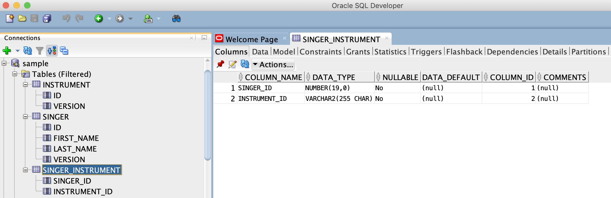
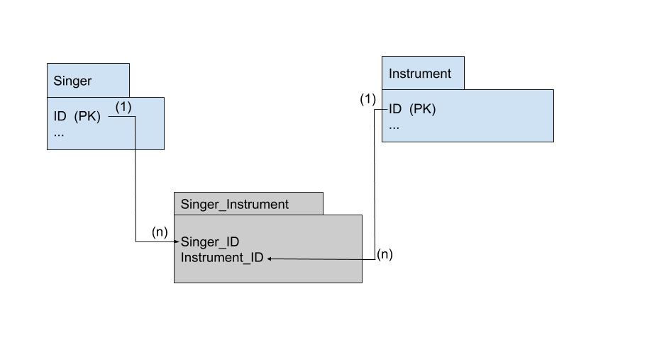

== Many-to-Many Correct configuration example

This repository is a simple SPring Boot project that demonstrates the correct configuration of a Many-to-Many relationship.

We have a Many-to-Many relationship between Singer and Instrument entities.

The database used is an Oracle database that is provided via a Docker container.

If you want to use an Oracle database, for this exercise the recommendation is to use a local Docker instance.

For the @Entity classes Singer and Instrument, Hibernate generates tables SINGER and INSTRUMENT. Both of them have a column named ID that is the primary key.

For the Many-to-Many relationship a table is generated named SINGER_INSTRUMENT. You can view this table using SQL Developer.

Internally between SINGER and SINGER_INSTRUMENT the relationship is One-To-Many, the owning side of the relationship is SINGER and
the foreign key column in SINGER_INSTRUMENT is SINGER_ID.

Internally between INSTRUMENT and SINGER_INSTRUMENT the relationship is One-To-Many, the owning side of the relationship is INSTRUMENT and
the foreign key column in SINGER_INSTRUMENT is INSTRUMENT_ID.

In case this is not obvious, the following image depicts the relationship between tables.

Just run the _*src/main/java/com/tables/manytomany/ManyToManyApplication.java*_ class to generate the tables

== Getting Started with Spring Boot

=== Reference Documentation
For further reference, please consider the following sections:

* [Official Gradle documentation](https://docs.gradle.org)

=== Guides
The following guides illustrate how to use some features concretely:

* [Accessing Data with JPA](https://spring.io/guides/gs/accessing-data-jpa/)

=== Additional Links
These additional references should also help you:

* [Gradle Build Scans – insights for your project's build](https://scans.gradle.com#gradle)

== Database

Install Docker (https://www.docker.com/).

Then install this container: https://hub.docker.com/_/oracle-database-enterprise-edition.
Follow instructions on the container page and test your database using Oracle SQL Developer.

Open a terminal
View containers:
----
docker container ls
----
or
----
docker ps
----

You can also install Kitematic to view and manage your containers.

==== Oracle 12c in a docker container -> SQL script needed to create the user and schema:

----
CREATE USER prod IDENTIFIED BY sample;
GRANT CONNECT TO sample;
GRANT CONNECT, RESOURCE, DBA TO sample;
GRANT CREATE SESSION TO sample;
GRANT UNLIMITED TABLESPACE TO sample;
----